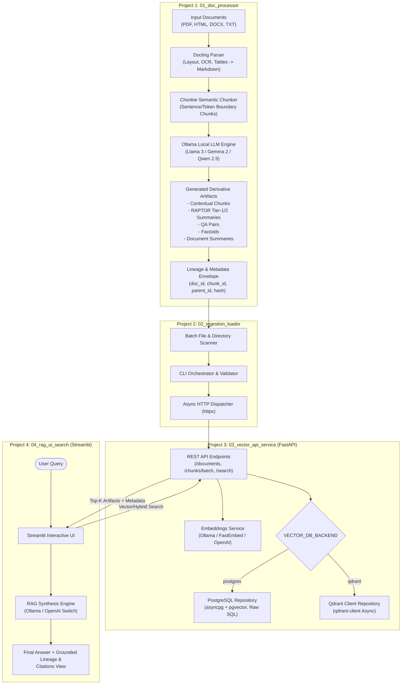
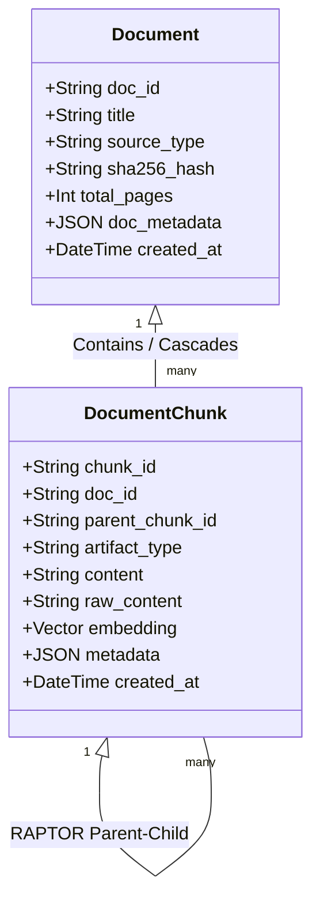

# High-Level Design (HLD) Document: Enterprise Modular RAG Platform

## 1. Document Control & Metadata

| Attribute | Value |
| :--- | :--- |
| **Document Title** | High-Level Design: Enterprise Modular Multi-Representation RAG Platform |
| **Status** | Draft / In-Review |
| **Version** | 1.0.0 |
| **Date** | 2026-08-29 |
| **Target Runtime** | Python 3.11+, PostgreSQL 16+ (pgvector) / Qdrant, Ollama / OpenAI, Streamlit, FastAPI |

---

## 2. Executive Summary & Goals

### 2.1 Problem Statement
Enterprise documents (PDFs, multi-page technical manuals, HTML exports, DOCX files, TXT notes) often span dozens or hundreds of pages with heterogeneous structures (tables, headings, lists). Naive fixed-size chunking leads to context loss, fractured answers, and poor retrieval accuracy.

### 2.2 Solution Strategy
This platform decouples document processing, vector ingestion, database management, and UI query serving into **four isolated, modular projects**. It transforms raw input into **rich derivative artifacts** (Semantic Chunks, Contextualized Chunks, Abstractive Summaries, 2-Tier RAPTOR Hierarchies, Synthetic QA Pairs, Factoids) and supports dual vector database backends (**PostgreSQL with `pgvector` via `asyncpg`** without SQLAlchemy, or **Qdrant**), coupled with local on-premise LLMs (Ollama) or external APIs (OpenAI).

---

## 3. High-Level System Architecture



---

## 4. Multi-Project Directory Structure

The system is organized into four independent projects, each containing its own configuration, tests, dependencies, and entry points:

```text
ai-enterprise-rag/
├── 01_doc_processor/                 # Project 1: Parsing, Chunking & Artifact Extraction
│   ├── src/
│   │   ├── parsers/                  # Docling multi-format document parser
│   │   │   ├── base.py
│   │   │   └── docling_parser.py
│   │   ├── chunkers/                 # Chonkie semantic chunking implementation
│   │   │   ├── base.py
│   │   │   └── semantic_chunker.py
│   │   ├── generators/               # Ollama derivative artifact generators
│   │   │   ├── contextual_generator.py
│   │   │   ├── raptor_generator.py
│   │   │   ├── qa_generator.py
│   │   │   ├── factoid_generator.py
│   │   │   └── summary_generator.py
│   │   ├── models/                   # Lineage and artifact data models
│   │   │   ├── document.py
│   │   │   ├── chunk.py
│   │   │   └── lineage.py
│   │   ├── config.py                 # Processor settings (Ollama model names, chunk limits)
│   │   └── pipeline.py               # Orchestrator running parser -> chunker -> LLM artifacts
│   ├── tests/
│   ├── pyproject.toml / requirements.txt
│   └── README.md
│
├── 02_ingestion_loader/              # Project 2: Batch Ingestion & API Dispatcher
│   ├── src/
│   │   ├── client/                   # Async HTTP client wrapper for Project 3 API
│   │   │   └── api_client.py
│   │   ├── loader.py                 # File scanner, batcher, and deduplication checker
│   │   ├── cli.py                    # CLI entry point with progress bar (Rich/Click/Typer)
│   │   └── config.py                 # Target API URLs, concurrency limits, batch size
│   ├── tests/
│   ├── pyproject.toml / requirements.txt
│   └── README.md
│
├── 03_vector_api_service/            # Project 3: Vector Storage & CRUD FastAPI Backend
│   ├── src/
│   │   ├── api/                      # REST API routes
│   │   │   ├── v1/
│   │   │   │   ├── documents.py      # Document CRUD & lineage endpoints
│   │   │   │   ├── chunks.py         # Chunk batch ingestion endpoints
│   │   │   │   ├── search.py         # Similarity / Hybrid search endpoints
│   │   │   │   └── health.py         # Health check & DB status
│   │   │   └── router.py
│   │   ├── db/
│   │   │   ├── base.py               # Abstract Vector & Metadata Repository interface
│   │   │   ├── postgres/             # asyncpg + pgvector implementation (NO SQLAlchemy)
│   │   │   │   ├── connection.py     # Connection pool manager
│   │   │   │   ├── schema.sql        # Raw DDL for tables and HNSW/IVFFlat indexes
│   │   │   │   └── repository.py     # asyncpg raw SQL queries
│   │   │   ├── qdrant/               # Qdrant client repository implementation
│   │   │   │   ├── connection.py
│   │   │   │   └── repository.py
│   │   │   └── factory.py            # Dynamic backend selector (postgres vs qdrant)
│   │   ├── embeddings/               # Configurable embedding adapters
│   │   │   ├── base.py
│   │   │   ├── ollama_embed.py
│   │   │   ├── fastembed_embed.py
│   │   │   ├── openai_embed.py
│   │   │   └── factory.py
│   │   ├── schemas/                  # Request / Response Pydantic models
│   │   │   ├── document_dto.py
│   │   │   ├── chunk_dto.py
│   │   │   └── search_dto.py
│   │   ├── config.py                 # Pydantic BaseSettings (DB URLs, API keys, backends)
│   │   └── main.py                   # FastAPI app bootstrap and lifecycle
│   ├── tests/
│   ├── pyproject.toml / requirements.txt
│   └── README.md
│
└── 04_rag_ui_search/                 # Project 4: Interactive Streamlit UI
    ├── src/
    │   ├── api_client.py             # Client communicating with Project 3 FastAPI
    │   ├── rag_engine.py             # Prompt builder & LLM caller (Ollama or OpenAI)
    │   ├── components/               # Streamlit visual components
    │   │   ├── search_bar.py         # Search controls & filters
    │   │   ├── result_card.py        # Chunk and citation display
    │   │   └── lineage_viewer.py     # Document hierarchy and parent-child tree inspector
    │   ├── config.py                 # UI configurations
    │   └── app.py                    # Streamlit entry point (`streamlit run src/app.py`)
    ├── tests/
    ├── pyproject.toml / requirements.txt
    └── README.md
```

---

## 5. Detailed Component Specifications

### 5.1 Project 1: Document Processor & Derivative Artifact Generator (`01_doc_processor`)

#### Purpose
Ingest multi-page, heterogeneous documents, parse them into standardized Markdown, apply semantic chunking, and generate enriched derivative representations using on-premise Ollama models.

#### Processing Pipeline
1. **Document Conversion (`Docling`)**:
   - Parses PDF, DOCX, HTML, and TXT files.
   - Extracts structured elements (tables, headers, nested lists, images/captions) and produces clean Markdown.
   - Extracts document-level metadata: title, author, creation timestamp, page count, and SHA256 checksum.
2. **Semantic Chunking (`Chonkie`)**:
   - Uses `chonkie` semantic chunker to split the document into coherent passages based on natural linguistic and semantic boundaries.
   - Maintains header path context (e.g., `# Section 2 > ## Subsection 2.1`) for each chunk.
3. **Derivative Artifact Generation (Local Ollama LLM)**:
   - **Contextual Chunks**: Prompts Ollama with the whole document context + specific chunk to prepend a 1-2 sentence context clarifying ambiguous pronouns or background.
   - **Abstractive Summaries**: High-level summaries generated per document and major section.
   - **Lightweight 2-Tier RAPTOR**: Groups adjacent semantic chunks by topic, generating parent summary nodes linked directly to leaf chunks.
   - **Synthetic QA Pairs**: Generates 3-5 diverse questions and precise answers per chunk to optimize retrieval against conversational user queries.
   - **Factoids**: Extracts atomic factual propositions and named entities for precision verification.

#### Data Lineage Schema
Every chunk and artifact generated shares a unified lineage envelope:

```json
{
  "doc_id": "doc_9f83a2...",
  "doc_title": "Q3_Financial_Review.pdf",
  "doc_sha256": "e3b0c44298fc1c149afbf4c8996fb92427ae41e4649b934ca495991b7852b855",
  "doc_source_type": "pdf",
  "chunk_id": "chk_1024_a1",
  "parent_chunk_id": "raptor_lvl1_05",
  "artifact_type": "contextual_chunk",
  "content": "Context: This section details Q3 APAC operating revenues. Text: Operating revenues in the APAC region grew by 14%...",
  "raw_content": "Operating revenues in the APAC region grew by 14%...",
  "metadata": {
    "page_number": 12,
    "header_path": "Financials > Regional Performance > APAC",
    "token_count": 148,
    "created_at": "2026-08-29T10:00:00Z"
  }
}
```

---

### 5.2 Project 2: Ingestion Loader (`02_ingestion_loader`)

#### Purpose
Automate the batching, validation, deduplication check, and network transmission of parsed document artifacts to the FastAPI backend.

#### Key Functions
- **Batch Processing**: Scans input directories (or reads Project 1 JSONL outputs), batches records (e.g., 50 chunks per request), and uploads to Project 3.
- **Checksum Deduplication**: Queries the API to check if `doc_sha256` has already been ingested before sending heavy payloads.
- **Resilience**: Configurable exponential backoff, retry handling on HTTP 5xx / 429, and concurrency throttling.
- **CLI Interface**: Provides a command-line interface with interactive progress tracking, summary reports, and error logs.

---

### 5.3 Project 3: Vector Storage & CRUD FastAPI (`03_vector_api_service`)

#### Purpose
Serve as the central data management and retrieval service. Handles document metadata tracking, chunk vectorization, storage, and similarity search without using SQLAlchemy.

#### Database Strategy & Architectural Rule
- **No SQLAlchemy**: Database operations for PostgreSQL are implemented using **`asyncpg`** directly with raw parameterized SQL queries and connection pooling.
- **Dual Backend Switch**: Selected via configuration (`VECTOR_DB_BACKEND=postgres` or `VECTOR_DB_BACKEND=qdrant`).
  - **PostgreSQL (`pgvector`)**: Raw SQL schema utilizing the `vector` extension, HNSW/IVFFlat indexes, and relational integrity.
  - **Qdrant**: High-performance asynchronous vector collections with payload filtering.

#### Relational Data Schema (PostgreSQL `asyncpg` DDL)

```sql
-- PostgreSQL DDL for asyncpg execution

CREATE EXTENSION IF NOT EXISTS "uuid-ossp";
CREATE EXTENSION IF NOT EXISTS "vector";

-- 1. Documents Root Table
CREATE TABLE IF NOT EXISTS documents (
    doc_id VARCHAR(64) PRIMARY KEY,
    title TEXT NOT NULL,
    source_type VARCHAR(32) NOT NULL,
    file_path TEXT,
    sha256_hash VARCHAR(64) UNIQUE NOT NULL,
    total_pages INT DEFAULT 1,
    doc_metadata JSONB DEFAULT '{}'::jsonb,
    created_at TIMESTAMPTZ DEFAULT NOW(),
    updated_at TIMESTAMPTZ DEFAULT NOW()
);

-- 2. Chunks & Derivative Artifacts Table
CREATE TABLE IF NOT EXISTS document_chunks (
    chunk_id VARCHAR(64) PRIMARY KEY,
    doc_id VARCHAR(64) NOT NULL REFERENCES documents(doc_id) ON DELETE CASCADE,
    parent_chunk_id VARCHAR(64),
    artifact_type VARCHAR(32) NOT NULL, -- 'raw_chunk', 'contextual_chunk', 'raptor_summary', 'qa_pair', 'factoid', 'summary'
    content TEXT NOT NULL,
    raw_content TEXT,
    embedding vector(1536), -- Dimension configured based on embedding model
    metadata JSONB DEFAULT '{}'::jsonb,
    created_at TIMESTAMPTZ DEFAULT NOW()
);

-- Indexes for Fast Filtering & Vector Search
CREATE INDEX IF NOT EXISTS idx_doc_chunks_doc_id ON document_chunks(doc_id);
CREATE INDEX IF NOT EXISTS idx_doc_chunks_artifact_type ON document_chunks(artifact_type);
CREATE INDEX IF NOT EXISTS idx_doc_chunks_parent_id ON document_chunks(parent_chunk_id);
CREATE INDEX IF NOT EXISTS idx_doc_chunks_embedding_hnsw 
    ON document_chunks USING hnsw (embedding vector_cosine_ops)
    WITH (m = 16, ef_construction = 64);
```

#### Embeddings Architecture
An abstract `BaseEmbeddingService` interface with pluggable providers:
1. **Ollama Embeddings**: Local models (e.g., `nomic-embed-text`, `bge-m3`, `mxbai-embed-large`).
2. **FastEmbed**: In-process ONNX-optimized embeddings (`BAAI/bge-small-en-v1.5`).
3. **OpenAI Embeddings**: API-based (`text-embedding-3-small`, `text-embedding-3-large`).

#### Core REST API Contracts

| Method | Endpoint | Description |
| :--- | :--- | :--- |
| `POST` | `/api/v1/documents` | Register new document metadata and check if already exists. |
| `GET` | `/api/v1/documents/{doc_id}` | Retrieve document metadata and its associated chunks. |
| `DELETE` | `/api/v1/documents/{doc_id}` | Delete document and cascade-delete all chunks and vector entries. |
| `POST` | `/api/v1/chunks/batch` | Ingest a batch of chunks; automatically generates embeddings and inserts them. |
| `POST` | `/api/v1/search` | Execute vector similarity search with filters (`artifact_type`, `doc_id`, `score_threshold`, `top_k`). |
| `GET` | `/api/v1/health` | Health check and database connection pool verification. |

---

### 5.4 Project 4: Interactive RAG Search UI (`04_rag_ui_search`)

#### Purpose
Provide business users with an interactive, transparent RAG interface with full citation traceability and multi-artifact search filtering.

#### Key Features & UI Workflow
1. **Configurable Model Runner**:
   - Selector to toggle generation LLM between **Ollama (local/on-prem)** and **OpenAI**.
2. **Artifact Search Filter**:
   - Allows users to search against all artifacts or target specific representations (e.g., search *QA Pairs* for conversational queries, *RAPTOR Summaries* for broad questions, or *Contextual Chunks* for specific details).
3. **Answer Generation with Grounded Citations**:
   - Synthesizes the final answer and lists the exact source chunks, document titles, page numbers, and similarity scores.
4. **Lineage & Document Inspector**:
   - Expandable UI panel to inspect the parent-child relationships and view the raw document context behind any retrieved chunk.

---

## 6. Technology Stack Summary

| Layer / Role | Selected Technology | Alternative Options |
| :--- | :--- | :--- |
| **Document Parser** | `Docling` | PyMuPDF, Unstructured |
| **Semantic Chunker** | `Chonkie` | LangChain Semantic Chunker, Custom Splitting |
| **On-Premise LLM Engine** | `Ollama` (Llama 3.1, Gemma 2, Qwen 2.5) | vLLM, TGI |
| **Ingestion Dispatcher** | Python CLI (`httpx`, `Typer`, `Rich`) | Celery / Redis |
| **Backend API Framework** | `FastAPI` (Asynchronous) | - |
| **PostgreSQL Access** | `asyncpg` + `pgvector` (Raw SQL, **No SQLAlchemy**) | `psycopg3` |
| **Vector DB Alternative** | `Qdrant` (`qdrant-client` async) | Milvus, Chroma |
| **Embeddings** | Configurable: `Ollama` / `FastEmbed` / `OpenAI` | HuggingFace Sentence-Transformers |
| **User Interface** | `Streamlit` | Gradio, Next.js |

---

## 7. Lineage Tracking & Traceability Model



---

## 8. Automated Testing Strategy (Per Project)

Every project is equipped with isolated automated test suites using `pytest`, `pytest-asyncio`, and mocks/stubs for external services (Ollama, PostgreSQL/pgvector, Qdrant, OpenAI).

### 8.1 Project 1 Testing Suite (`01_doc_processor/tests/`)
- **Unit Tests (`test_parsers.py`)**:
  - Test Docling parsing across PDF, HTML, DOCX, TXT sample files.
  - Verify Markdown table and header structure preservation.
- **Chunking Tests (`test_chunkers.py`)**:
  - Verify Chonkie semantic boundary chunking, token lengths, and heading context propagation.
- **Generator Tests (`test_generators.py`)**:
  - Mock Ollama API responses to verify prompt execution and output parsing for Contextual chunks, RAPTOR 2-tier trees, QA pairs, Factoids, and Summaries.
- **Schema & Lineage Tests (`test_models.py`)**:
  - Validate SHA256 hashing, parent-child ID lineage links, and JSON serialization.

### 8.2 Project 2 Testing Suite (`02_ingestion_loader/tests/`)
- **API Client Tests (`test_client.py`)**:
  - Test `httpx` client with `pytest-httpx` / `respx` mock server.
  - Verify retry mechanics on HTTP 429/500 and timeout handling.
- **Loader & Batching Tests (`test_loader.py`)**:
  - Validate batch partitioning (e.g. 50 items/batch) and checksum deduplication logic.
- **CLI Tests (`test_cli.py`)**:
  - Test Typer/Click CLI execution commands with mock inputs and error flags.

### 8.3 Project 3 Testing Suite (`03_vector_api_service/tests/`)
- **API Router Tests (`test_api_v1.py`)**:
  - Using `httpx.AsyncClient` + `ASGITransport` with FastAPI `app`.
  - Validate `/api/v1/documents` CRUD operations (Create, Read, Delete with cascade).
  - Validate `/api/v1/chunks/batch` ingestion and validation.
  - Validate `/api/v1/search` with artifact filtering (`qa_pair`, `contextual_chunk`, `raptor_summary`).
- **Database Repository Tests (`test_db_postgres.py` & `test_db_qdrant.py`)**:
  - Test raw SQL query execution in `asyncpg` repository (No SQLAlchemy).
  - Test Qdrant payload filters and vector insertion/search.
- **Embedding Factory Tests (`test_embeddings.py`)**:
  - Test dimension validation and fallback switches across Ollama, FastEmbed, and OpenAI adapters.

### 8.4 Project 4 Testing Suite (`04_rag_ui_search/tests/`)
- **RAG Engine Tests (`test_rag_engine.py`)**:
  - Test prompt assembly, context grounding, and citation generation with mocked Ollama/OpenAI responses.
- **API Client Adapter Tests (`test_ui_api_client.py`)**:
  - Test payload formatting and error handling when connecting to Project 3.
- **UI Component Unit Tests (`test_components.py`)**:
  - Test lineage tree formatter, score threshold filtering, and result card data extraction.

---

## 9. Development & Deployment Roadmap

1. **Phase 1: Project 1 (`01_doc_processor`)**
   - Implement Docling parser wrapper and Chonkie chunker.
   - Build Ollama prompt chains for Contextual chunks, RAPTOR summaries, QA pairs, and Factoids.
   - Write automated test suite in `01_doc_processor/tests/` and verify with `pytest`.

2. **Phase 2: Project 3 (`03_vector_api_service`)**
   - Implement `asyncpg` raw SQL connection pool, DDL migrations, and Qdrant adapter.
   - Build embedding provider factory and FastAPI routes.
   - Write automated integration & unit tests in `03_vector_api_service/tests/` and verify.

3. **Phase 3: Project 2 (`02_ingestion_loader`)**
   - Build CLI batch processor, deduplication checks, and `httpx` API client.
   - Write automated test suite in `02_ingestion_loader/tests/` and verify.

4. **Phase 4: Project 4 (`04_rag_ui_search`)**
   - Build Streamlit search and answer synthesis interface with Ollama/OpenAI toggle.
   - Write automated test suite in `04_rag_ui_search/tests/` and verify.
